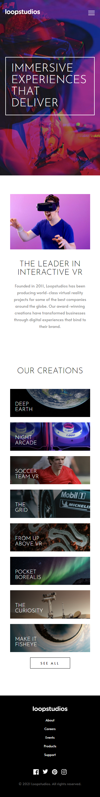
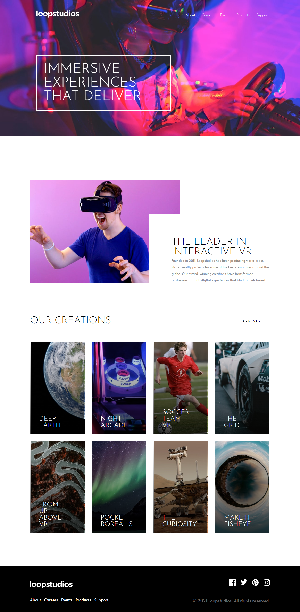

# Frontend Mentor - Loopstudios landing page solution

This is a solution to the [Loopstudios landing page challenge on Frontend Mentor](https://www.frontendmentor.io/challenges/loopstudios-landing-page-N88J5Onjw). Frontend Mentor challenges help you improve your coding skills by building realistic projects.

## Table of contents

- [Overview](#overview)
  - [The challenge](#the-challenge)
  - [Screenshots](#screenshot)
  - [Links](#links)
- [My process](#my-process)
  - [Built with](#built-with)
  - [What I learned](#what-i-learned)
  - [Continued development](#continued-development)
  <!-- - [Useful resources](#useful-resources) -->
- [Author](#author)
- [Acknowledgments](#acknowledgments)

## Overview

### The challenge

Users should be able to:

- View the optimal layout for the site depending on their device's screen size
- See hover states for all interactive elements on the page

### Screenshots

> Mobile
> 

> Desktop
> 

### Links

- Solution URL: [https://github.com/Willwf/loopstudios-landing-page](https://github.com/Willwf/loopstudios-landing-page)
- Live Site URL: [https://loopstudios-landing-page-sage.vercel.app/](https://loopstudios-landing-page-sage.vercel.app/)

## My process

### Built with

- Semantic HTML5 markup
- CSS custom properties
- Flexbox
- CSS Grid
- Mobile-first workflow
- [React](https://reactjs.org/) - JS library
- [Styled Components](https://styled-components.com/) - For styles

### What I learned

I've used this project to reinforce some HTML, CSS and JS concepts, React training and, mostly, to use styled-components. This is my first time using it and I really think that it's very interesting. There are some things that I still need to understand, but is very useful to manage the components, especially when your project is getting too big.

### Continued development

For my next project I'm willing to do something using an external API, to fully understand and learn about it, as well something to start learn about back-end.

<!-- ### Useful resources

- [Example resource 1](https://www.example.com) - This helped me for XYZ reason. I really liked this pattern and will use it going forward.
- [Example resource 2](https://www.example.com) - This is an amazing article which helped me finally understand XYZ. I'd recommend it to anyone still learning this concept. -->

## Author

- Github - [William Firmino](https://github.com/Willwf)
- Frontend Mentor - [@Willwf](https://www.frontendmentor.io/profile/Willwf)
- Twitter - [@Williamwf](https://www.twitter.com/Williamwf)
- LinkedIn - [William Firmino](https://www.linkedin.com/in/williamfirmino/)
